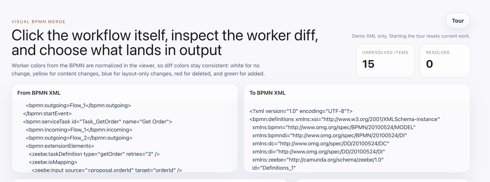
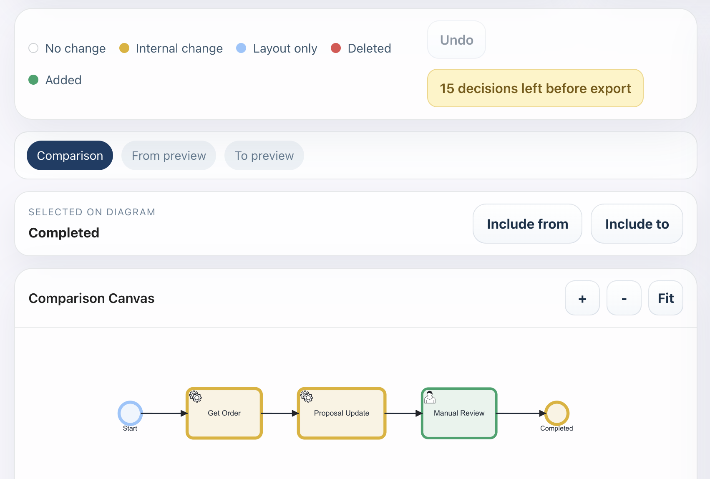
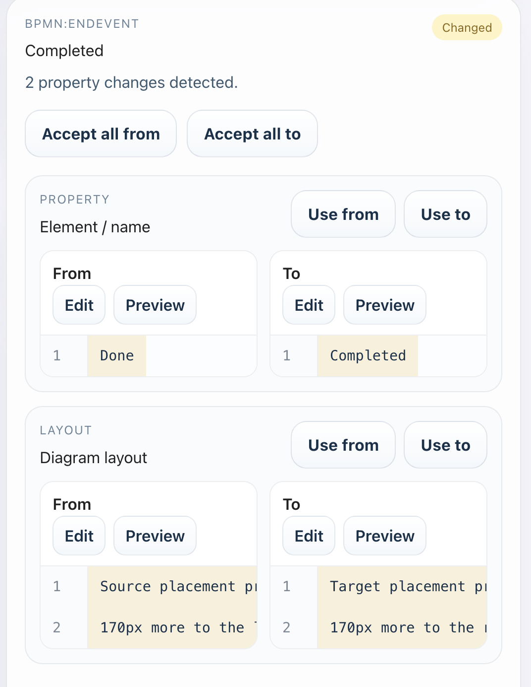
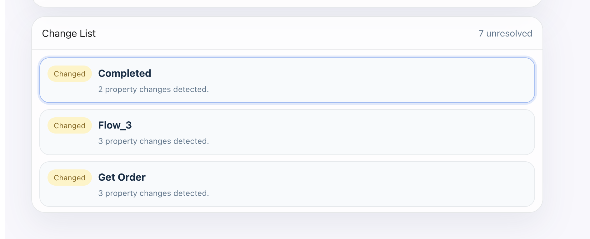

# BPMN Diff Merger

Visual BPMN diff and merge tool for teams that review workflow changes in pull requests, Git branches, or hand-edited XML files.

This project is built for one painful reality: BPMN files are XML, and raw Git diffs are usually too noisy to review safely. Instead of comparing flattened XML line-by-line, **BPMN Diff Merger** lets you inspect the workflow visually, review worker-level changes, compare JSON payload differences, preview impacted nodes on the diagram, and choose what should land in the merged output.

## Product Preview

Save the screenshots you shared using these exact filenames inside [`assets/`](./assets):

- `hero-overview.png`
- `comparison-canvas.png`
- `inspector-panel.png`
- `change-list.png`



The landing screen frames the merge workflow clearly: two BPMN XML inputs, unresolved counts, demo-aware tour entry, and the main positioning of the tool.



The comparison canvas is the primary merge surface, with visual diff colors, preview modes, zoom controls, and element-level include actions.



The inspector supports whole-element acceptance, field-level merge resolution, JSON editing, and preview-on-diagram for worker inputs and layout changes.



The change list makes dense BPMN diagrams easier to review by letting users jump directly to unresolved workflow diffs.

If you searched GitHub for any of these, this project is for you:

- `bpmn diff`
- `bpmn merge`
- `visual bpmn diff`
- `bpmn git merge`
- `camunda bpmn compare`
- `camunda workflow diff`
- `bpmn xml merge tool`
- `zeebe bpmn merge`

## Why This Exists

Merging BPMN files through plain XML review is hard because:

- workflow intent is hidden behind XML structure
- layout changes and semantic changes are mixed together
- worker input/output changes often contain large JSON payloads
- added or removed sequence flows are hard to reason about from text alone
- Git conflict resolution does not understand BPMN semantics

This tool turns that into a visual workflow:

1. paste a `from` BPMN and a `to` BPMN
2. inspect differences directly on the diagram
3. click a worker, gateway, event, or flow
4. review worker properties, JSON inputs, and layout changes
5. choose `Use from` or `Use to`
6. export a merged BPMN only after all decisions are resolved

## What It Does

- Visual BPMN comparison canvas with click-to-inspect behavior
- Change categories for:
  - no change
  - content change
  - layout-only change
  - added
  - removed
- Worker-level diff inspection
- JSON-aware side-by-side comparison for `zeebe:input`-style payloads
- JSON editing before choosing `from` or `to`
- Live merged preview as you resolve changes
- Change list navigation for dense workflows
- Zoom, pan, fit, highlight, and preview actions on the diagram
- Undo support for merge decisions
- Guided product tour built into the app
- Demo BPMN XMLs included for quick evaluation

## Tour Feature

The app includes a built-in product tour so new users can understand the merge flow without reading the XML first.

The tour walks through:

- BPMN XML inputs
- diff color legend
- unresolved count and export gate
- comparison / preview modes
- diagram navigation
- change list navigation
- `Include from` / `Include to`
- `Accept all from` / `Accept all to`
- field-level `Use from` / `Use to`
- JSON `Edit`
- diagram `Preview`

Current tour behavior:

- the tour is designed for the bundled demo BPMN XMLs
- starting the tour resets the app back to the demo files
- the app warns that current work will be discarded before the tour begins

Why this matters:

- onboarding becomes much easier for BPMN reviewers who are new to the tool
- feature discovery happens inside the product, not only in documentation
- the demo XMLs act like a guided sandbox before users paste real BPMNs

## Local Run

### Prerequisites

- Node.js 18+ recommended
- npm 9+ recommended

### Install

```bash
npm install
```

### Start The Dev Server

```bash
npm run dev
```

Then open the local URL printed by Vite, usually:

```text
http://localhost:5173
```

### Production Build

```bash
npm run build
```

### Preview The Production Build

```bash
npm run preview
```

## Fork And Publish On GitHub

1. Fork this repository on GitHub.
2. Clone your fork locally.
3. Install dependencies.
4. Run the app locally and verify the demo BPMNs load.
5. Add your screenshots under `assets/` using the filenames from the `Product Preview` section.
6. Commit the README and screenshots.
7. Push to your fork.

Example:

```bash
git clone https://github.com/<your-username>/bpmn-diff-merger.git
cd bpmn-diff-merger
npm install
npm run dev
```

## Project Structure

```text
bpmn-diff-merger/
├── assets/
├── src/
│   ├── App.tsx
│   ├── BpmnViewer.tsx
│   ├── bpmnMerge.ts
│   ├── main.tsx
│   ├── sample-bpmn.ts
│   ├── styles.css
│   ├── types.ts
│   └── types/
│       └── vendor.d.ts
├── index.html
├── package.json
├── tsconfig.json
├── tsconfig.app.json
└── vite.config.ts
```

## Current Scope

This version focuses on **visual BPMN diff and merge**.

It is especially useful for:

- Camunda / Zeebe workflow XML review
- comparing worker changes
- reviewing input mapping changes
- merging layout and semantic changes safely

DMN support is planned separately and is not the primary focus of this starter package.

## Merge Model

The tool currently works as a human-guided merge assistant:

- it compares `from` and `to`
- it visualizes unresolved BPMN changes
- it allows element-level or field-level acceptance
- it updates the preview BPMN live
- it exports only after all merge decisions are resolved

This makes it useful for:

- manual merge review before committing
- PR conflict analysis
- BPMN workflow change review in product / ops / platform teams

## Good Search Terms For Discoverability

If you publish this repository, keep these terms in the title, description, README, or topics:

- `bpmn`
- `bpmn-diff`
- `bpmn-merge`
- `camunda`
- `zeebe`
- `workflow-diff`
- `workflow-merge`
- `xml-diff`
- `git-merge-tool`
- `visual-diff`

## Notes

- This repository is a standalone runnable package extracted from a larger working prototype.
- The included demo BPMNs are meant to show the UX and merge workflow quickly.
- Real-world BPMN variations may need additional matcher heuristics depending on how your models are generated.

## License

Add the license that matches how you want to publish the repository before making it public.
